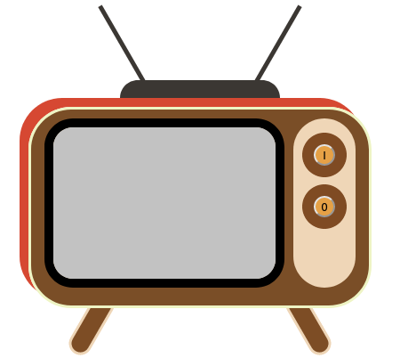

## Manipuler le DOM

Nous allons explorer les principales opérations de la manipulation du DOM en rendant une vieille TV interactive. Tu vas mettre en pratique la récupération, l'écoute et la manipulation du DOM.

Clone ce dépôt grâce au lien fourni au début de cette page ⬆, dans la section <a href="#input-clone"><i class="bi bi-code-slash"></i> Code</a>
{: .alert-info }

Le dépôt contient un fichier `index.html` à la racine. En l'ouvrant dans ton navigateur, tu devrais voir apparaitre mon vieux poste de télévision :


{: .text-center }

## Piqûre de rappel

Lorsque tu charges une page web, ton navigateur crée une représentation de cette page sous forme d'un arbre d'objets. Chaque élément HTML (tels que les titres, les paragraphes, les images, etc...) devient **un objet** dans cet arbre. Garde bien cela en tête, ça te servira un peu plus tard dans l'exercice 😉

## Récupérer

L'étape de récupération des éléments du DOM est fondamentale pour toute manipulation ultérieure.
Elle repose sur plusieurs méthodes que nous allons explorer.
Pour illustrer cela, prenons l'exemple de la liste des boutons dans `index.html` :

```html
<ul class="television__channels">
  <li class="television__channel">
    <button class="television__button television__button--on" type="button">
      I
    </button>
  </li>
  <li class="television__channel">
    <button class="television__button television__button--off" type="button">
      O
    </button>
  </li>
</ul>
```

Dans notre fichier JavaScript `index.js`, nous allons utiliser différentes méthodes pour récupérer ces boutons et les afficher dans la console.
Voici les lignes de code que tu dois ajouter :

```js
console.log(document.getElementsByTagName("button"));
console.log(document.getElementsByClassName("television__button"));
console.log(document.querySelector(".television__button"));
console.log(document.querySelectorAll(".television__button"));
```

Prends un moment pour réfléchir à ce que chaque ligne de code produira comme résultat.
Note que nous utilisons des sélecteurs CSS pour cibler les éléments.
Par exemple, la différence entre `"television__button"` et `".television__button"` est cruciale. Pourquoi penses-tu qu'il y a cette différence ?
Utilise la documentation pour approfondir ta compréhension des différentes méthodes :

- [getElementsByTagName](https://developer.mozilla.org/fr/docs/Web/API/Document/getElementsByTagName)
- [getElementsByClassName](https://developer.mozilla.org/fr/docs/Web/API/Document/getElementsByClassName)
- [querySelector](https://developer.mozilla.org/fr/docs/Web/API/Document/querySelector)
- [querySelectorAll](https://developer.mozilla.org/fr/docs/Web/API/Document/querySelectorAll)

Pour vérifier tes hypothèses, ouvre la page `index.html` dans ton navigateur, ouvre l'inspecteur, puis navigue vers la console.
Après avoir rechargé la page, tu devrais voir quelque chose de similaire à ceci :

```bash
HTMLCollection { 0: button.television__button.television__button--on, 1: button.television__button.television__button--off, 2: button, length: 3 }
index.js:1:9

HTMLCollection { 0: button.television__button.television__button--on, 1: button.television__button.television__button--off, length: 2 }
index.js:2:9

<button class="television__button television__button--on" type="button">
index.js:3:9

NodeList [ button.television__button.television__button--on, button.television__button.television__button--off ]
index.js:4:9
```

Cette sortie de console devrait t'aider à comprendre comment chaque méthode récupère les éléments du DOM et pourquoi elles peuvent parfois renvoyer des résultats différents.

🧠 **Exercice :** 

Supprime toutes les lignes, sauf celle qui appelle la méthode `querySelectorAll`. À la place de la méthode `console.log`, stocke la récupération des boutons dans une variable `buttons`.  

__________________________________

Une fois l'exercice réalisé, et maintenant que tu as exploré les **différentes méthodes de récupération** des éléments du DOM, passons à une étape plus pratique : **l'écoute des événements**.

## Écouter

Grâce à nos connaissances en JavaScript, nous savons qu'il est possible d'itérer sur un tableau ! Pour cela, plusieurs façons de faire existent, mais nous te proposons de te familiariser avec la [boucle `for...of`](https://developer.mozilla.org/fr/docs/Web/JavaScript/Reference/Statements/for...of).

🧠 **Exercice :** 

Créé une boucle `for... of`, dont l'objectif est d'afficher en console tous les éléments contenus dans la variable `buttons` 😄. La méthode `console.log()` va t'être utile !

__________________________________

Recharge la page, et regarde la console de ton navigateur : tu devrais voir chaque bouton s'afficher dans la console.

Mais pour l'instant, rien de très interactif 😕

Tu vas maintenant ajouter un **écouteur d'événements** à chacun d'eux pour détecter les clics.
Remplace le `console.log` dans la boucle par ce code :

```js
button.addEventListener("click", () => {
  alert("Clic !");
});
```

En résumé, sur chacun des deux boutons stockés dans ta variable `buttons`, tu as associé un événement : les 2 boutons ouvrent une boîte de dialogue si tu cliques dessus.

Pour cela, tu as utilisé la [méthode `addEventListener`](https://developer.mozilla.org/fr/docs/Web/API/EventTarget/addEventListener), qui attend 2 paramètres :

- le type d'événement que tu veux écouter : `"click"` (il y en [beaucoup d'autres...](https://developer.mozilla.org/fr/docs/Web/Events)).
- le code à exécuter quand l'événement arrivera : c'est la fonction `() => { alert("Clic !"); }`

Rappelle toi que **stocker du code** pour l'éxecuter plus tard est le **rôle des fonctions**.
{: .alert-info }

Voici le code complet si tu as perdu le fil :

```js
const buttons = document.querySelectorAll(".television__button");

for (const button of buttons) {
  button.addEventListener("click", () => {
    alert("Clic !");
  });
}
```

Recharge la page, et clique sur les boutons 🙂

Tu as maintenant tous les outils à disposition pour **récupérer et écouter** des éléments HTML.
Il te reste à expérimenter la modification du DOM.

## Modifier

Dans cette section, tu vas modifier l'état de la télévision en fonction des actions de l'utilisateur.
Premièrement, récupère le bouton "on" :

```js
const buttonOn = document.querySelector(".television__button--on");
```

Ensuite, ajoute un écouteur d'événements à ce bouton :

```js
buttonOn.addEventListener("click", () => {
  // TODO
});
```

Notre objectif est de modifier l'image affichée dans la télévision au moment du clic.
Techniquement, nous voulons modifier la valeur de l'attribut `src` de cette image dans `index.html` :

```html

```

Dans l'introduction de cet exercice, tu te rappellestu quand nous disions que chaque élément HTML était **un objet** ? C'est maintenant que c'est important de le comprendre 😀

🧠 **Exercice :** 

Ton objectif est de déclarer une variable `img`, et d'y assigner l'élément du DOM correspondant à l'image.
Pour l'identifier, tu peux effectuer un **clique droit > inspecter** sur ta page web pour faire apparaître le DOM, trouver l'élément `<ìmg />` et copier son nom de classe. Ensuite, tu peux utiliser la méthode `querySelector` pour faire ta sélection 😉

________________________________

Une fois l'élément récupéré et stocké, tu peux modifier son attribut `src`. Voici comment :

```js
img.src = "https://picsum.photos/id/237/270/190?grayscale";
```

Le code complet que tu devrais obtenir :

```js
const buttonOn = document.querySelector(".television__button--on");

buttonOn.addEventListener("click", () => {
  const img = document.querySelector(".television__content");

  img.src = "https://picsum.photos/id/237/270/190?grayscale";
});
```

Recharge la page, et clique sur le bouton du haut sur la TV : après l'alerte `"Clic !"`, l'image devrait apparaitre.

**À toi de jouer :** écoute le bouton `".television__button--off"`.
Quand il est cliqué, modifie la source de l'image pour revenir au gris :

```js
img.src =
  "data:image/gif;base64,R0lGODlhAQABAIAAAMLCwgAAACH5BAAAAAAALAAAAAABAAEAAAICRAEAOw==";
```

<details markdown=block>
<summary markdown=span>
La solution ?
</summary>

```js
const buttonOff = document.querySelector(".television__button--off");

buttonOff.addEventListener("click", () => {
  const img = document.querySelector(".television__content");

  img.src =
    "data:image/gif;base64,R0lGODlhAQABAIAAAMLCwgAAACH5BAAAAAAALAAAAAABAAEAAAICRAEAOw==";
});
```

</details>

## Bonus : la vie en couleur

Pour aller plus loin, tu peux ajouter une fonctionnalité pour permettre à l'utilisateur de basculer entre les images en couleur et en niveaux de gris.

Pour rappel, voici à quoi ressemble la liste en HTML :

```html
<ul class="television__channels">
  <li class="television__channel">
    <button class="television__button television__button--on" type="button">
      I
    </button>
  </li>
  <li class="television__channel">
    <button class="television__button television__button--off" type="button">
      O
    </button>
  </li>
</ul>
```

Tu vas ajouter un nouvel élément dans la liste.
Mais tu vas le faire intégralement avec du JavaScript !

D'abord créer l'élément `<li>` avec la classe `"television__channel"` :

```js
const channelGrayscale = document.createElement("li");
channelGrayscale.classList.add("television__channel");
```

Cet élément est créé "dans le vide".
Pour qu'il puisse faire partie du DOM et apparaisse dans ton navigateur, tu dois l'ajouter à un élément existant :

```js
const channels = document.querySelector(".television__channels");
channels.appendChild(channelGrayscale);
```

Recharge la page, et vérifie dans l'inspecteur que ta liste a bien un 3e élément :

```html
<ul class="television__channels">
  <li class="television__channel">
    <button class="television__button television__button--on" type="button">
      I
    </button>
  </li>
  <li class="television__channel">
    <button class="television__button television__button--off" type="button">
      O
    </button>
  </li>
  <li class="television__channel"></li>
</ul>
```

S'il est bien présent, tu dois encore lui ajouter un bouton :

```js
const buttonGrayscale = document.createElement("button");
buttonGrayscale.type = "button";
buttonGrayscale.textContent = "T";

channelGrayscale.appendChild(buttonGrayscale);
```

Ta liste devrait devenir :

```html
<ul class="television__channels">
  <li class="television__channel">
    <button class="television__button television__button--on" type="button">
      I
    </button>
  </li>
  <li class="television__channel">
    <button class="television__button television__button--off" type="button">
      O
    </button>
  </li>
  <li class="television__channel"><button type="button">T</button></li>
</ul>
```

Le gros du code est terminé !

Ajoute un écouteur d'événements à ce nouveau bouton :

```js
buttonGrayscale.addEventListener("click", () => {
  // TODO
});
```

Pour basculer entre les images en couleur et en niveaux de gris, tu dois tester l'état actuel de l'image (en couleur ou en niveaux de gris), et changer la source de l'image en conséquence.
C'est à dire ajouter ou enlever la partie `?grayscale` dans l'URL (mais uniquement quand la source n'est pas `"data:image/gif;base64,..."`) :

```js
const img = document.querySelector(".television__content");

const isData = img.src.startsWith("data");

if (!isData) {
  const isGrayscale = img.src.endsWith("?grayscale");

  if (isGrayscale) {
    // so sad this doesn't work :/
    // img.src -= "?grayscale";
    img.src = img.src.slice(0, -"?grayscale".length);
  } else {
    img.src += "?grayscale";
  }
}
```

Recharge la page, et maintenant lorsque tu cliques sur le bouton "T", l'image devrait basculer entre la couleur et le niveau de gris !
